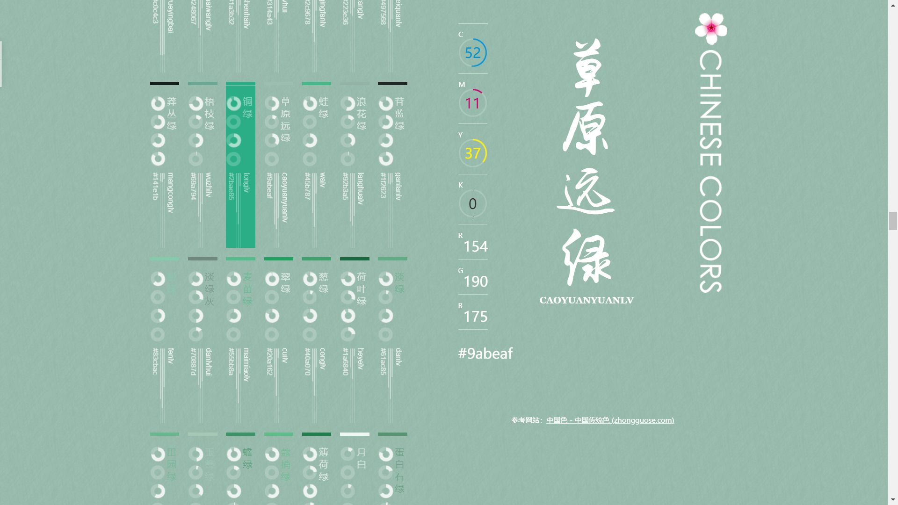

# ChineseColor项目介绍

## 来源

> 中国色 - 中国传统色  (zhongguose.com)

## 简介

> 旨在提供各种中国的传统颜色的名称，CMYK值，RGB值，16进制表示；
>
> 页面简洁清爽，但实现技术比较复杂，对于目前阶段的我具有一定的挑战。



## 页面分析

1. logo：位于页面最右侧靠上
2. 标题：位于页面次右侧，含色彩对应中文名称及拼音
3. CMYK色彩值：位于标题左侧上部，点击左侧不同颜色，C、M、Y、K四个圆环动态填充对应数值比例的颜色
4. RGB色彩值：位于标题左侧中部，点击左侧不同颜色，R、G、B数值滚动至对应数值
5. 十六进制色彩值：位于标题左侧下部，含色彩对应十六进制色彩值
6. 中国色 色彩信息列表：位于页面最左侧，共526中不同的色彩
7. 参考网站：位于页面左侧底部

##  布局思路

1. 创建一个等同于浏览器视口大小的div用来显示背景色
2. 创建一个container放置页面内容
3. 使用固定定位将logo固定于页面最右侧
4. 创建一个导航区，内部使用列表展示全部颜色信息
5. 在导航区右侧与logo左侧创建一个固定定位的内容区，内容区左侧为CMYK、RGB等数据，内容区右侧为颜色中文名和拼音
6. 使用固定定位将参考网站置于内容区下方

> 关键代码

```jajavascriptvascript
<div id="wrapper"></div>
<div id="container">
    <header id="logo">
        <h1>中国色 Chinese Colors</h1>
    </header>
    <nav>
        <ul id="colors"><!--颜色列表--></ul>
    </nav>
    <article id="data">
        <h2>
            <span id="name">中国色</span>
            <span id="pinyin">ZHONGGUOSE</span>
        </h2>
        <div id="color-value">
            <!--CMYK遮罩-->
            <dl id="CMYKcolor">...</dl>
            <!--RGB数值-->
            <div id="RGBcolor">...</div>
            <!--输出RGB值-->
            <div id="hexValue"><span></span></div>
        </div>
    </article>
    <footer>
        <p>参考网站：<a href="http://zhongguose.com/">中国色 - 中国传统色 (zhongguose.com)</a></p>
    </footer>
</div>
```

## 主要技术点

1. **ajax**，使用ajax获取colors.json文件数据

> 关键代码

```javascript
// ajax获取colors.json中的数据
let req = new XMLHttpRequest();
req.open('GET', '../data/colors.json',true);
req.onreadystatechange = function (){
    if(req.readyState == 4 && req.status == 200){
        colorList(req.responseText);
    }
    return;
};
req.send();
```

2. **json**，将获取到的json文件解析并通过JavaScript将颜色信息渲染为页面导航区列表项

> 关键代码

```javascript
// 通过获取的数据生成color的列表，添加至ul#colors
function colorList(data){
    // 解析color数据
    colorsArray = JSON.parse(data);
    // 颜色数组根据HSV颜色模型排序
    colorsArray.sort(function(a, b){
        if (rgb2hsv(a.RGB)[0] === rgb2hsv(b.RGB)[0])
            return rgb2hsv(b.RGB)[1] - rgb2hsv(a.RGB)[1];
        else
            return rgb2hsv(b.RGB)[0] - rgb2hsv(a.RGB)[0];
    });
    // 生成color的li元素内容并添加至ul中
    colorsArray.forEach(function (color, i){
        let liEl = document.createElement('li');
        liEl.style.top = Math.floor(i/7)*300 + 'px';
        liEl.style.left = Math.floor(i%7)*65 + 'px';
        liEl.style.borderTop = '6px solid ' + color.hex;
        let divEl = document.createElement('div');
        let aEl = document.createElement('a');
        aEl.innerHTML = `<span class="name" style="color: ${color.hex}">${color.name}</span>
                         <span class="pinyin">${color.pinyin}</span>
                         <span class="rgb">${color.hex}</span>`;
        aEl.appendChild(drawArcAndLine(color.CMYK, color.RGB));
        divEl.appendChild(aEl);
        liEl.appendChild(divEl);
        document.getElementById("colors").appendChild(liEl);
    });
}
```

3. **canvas**，使用canvas绘制颜色信息列表中的CMYK圆环和RGB数值条

> 关键代码

```javascript
// 使用canvas绘制CMYK圆环和RGB长条
function drawArcAndLine(CMYK, RGB){
    let canvas = document.createElement('canvas');
    canvas.width = 50;
    canvas.height = 278;
    let ctx = canvas.getContext('2d');
    ctx.strokeStyle = '#fff';
    // 绘制CMYK圆环
    ctx.lineWidth = 6;
    CMYK.forEach(function (value, i){
        let endAngle = (360*value/100-90)*(Math.PI/180);
        if(value == 0) endAngle = 1.5 * Math.PI;
        if(value == 100) endAngle = 3 * Math.PI;
        ctx.beginPath();
        ctx.arc(14,31.3 * (i+1),9,1.5 * Math.PI, endAngle, false);
        ctx.stroke();
    });
    // 绘制RGB长条
    ctx.lineWidth = 1;
    ctx.moveTo(18,150);
    ctx.lineTo(18,150 + RGB[2]/255*(278-150));
    ctx.moveTo(21,150);
    ctx.lineTo(21,150 + RGB[1]/255*(278-150));
    ctx.moveTo(24,150);
    ctx.lineTo(24,150 + RGB[0]/255*(278-150));
    ctx.stroke();
    return canvas;
}
```

4. **jQuery on()**方法，使用on()方法获取JavaScript动态生成的DOM结点，绑定mouseover、mouseout、click事件
   1. 使用mouseover、mouseout事件，让动态添加的颜色列表项实现hover效果，鼠标移入后背景色变为该颜色项对应颜色
   2. 使用click事件，在点击颜色项时，整个页面背景色变为该颜色项对应颜色，同时，右侧颜色中文名、拼音、CMYK、RGB、十六进制色值动态响应

> 关键代码

```javascript
// 为li > div添加鼠标事件
$('#colors').on('' +
    '', 'li > div', function (event){
    let aEl = $(this).children();
    let pinyin = aEl.children('.pinyin').html();
    // 查找算法有待优化 TODO
    let color = colorsArray.find(function (color){
        return pinyin === color.pinyin;
    });
    let name = color.name;
    let hex = color.hex;
    if (event.type == 'mouseover'){
        // 鼠标移入
        aEl.children('.name').css('color', '#fff');
        $(this).css('background-color', hex);
    }else if(event.type == 'mouseout'){
        // 鼠标移出
        $(this).css('background-color', 'transparent');
    }else if(event.type == 'click'){
        // 点击事件
        $('#wrapper').css('background-color', hex);      // 替换页面背景
        $('#data > h2 > #name').html(name);                    // 替换标题名
        $('#data > h2 > #pinyin').html(pinyin.toUpperCase());  //替换标题拼音
        maskCMYK(color.CMYK);       // CMYK遮罩效果
        countRollRGB(color.RGB);    // RGB数值滚动效果
        $('#hexValue > span').html(color.hex);
    }
});
```

5. **#### mask(遮罩)**，通过css的遮罩功能实现CMYK圆环动态加载效果

> 关键代码

```javascript
// CMYK遮罩效果
function maskCMYK(CMYK){
    let cont = $('#CMYKcolor > dd > .cont');
    let r = $('#CMYKcolor > dd > .r');
    let l = $('#CMYKcolor > dd > .l');
    CMYK.forEach(function (value, i){
        // 不能用array[]取jQuery对象数组！
        // cont[i].html(value);
        cont.eq(i).html(value);
        if (value < 50){
            r.eq(i).children().css("transform", `rotate(${value*3.6}deg)`);
            l.eq(i).children().css("transform", "rotate(180deg)");
        }else {
            r.eq(i).children().css("transform", "rotate(180deg)");
            l.eq(i).children().css("transform", `rotate(${(value)*3.6}deg)`);
        }
    });
}
```

6. **countUP**，通过countUP.js数值滚动插件实现RGB数值滚动加载

> 关键代码

```javascript
let startValue = [0, 0, 0];
// RGB数值滚动  (参考资料：https://blog.csdn.net/weixin_44110923/article/details/114693782)
function countRollRGB(RGB){
    RGB.forEach(function (value, i){
        let options = {
            startVal: startValue[i],
            duration: 1.5,
        };
        let demo = new countUp.CountUp('value'+'RGB'[i], value, options);
        startValue[i] = value;
        if (!demo.error) {
            demo.start();
        } else {
            console.error(demo.error);
        }
    });
}
```

7. RGB转HSV算法(了解)，由于HSV颜色模型对用户来说比较直观，因此将通过HSV模型将颜色排序后显示，视觉效果较佳

> 关键代码

```javascript
// RGB转HSV函数：HSV对用户来说是一种比较直观的颜色模型
let rgb2hsv = function (rgb) {
    let r = rgb[0]/255, g = rgb[1]/255, b = rgb[2]/255;
    let max = Math.max(r, g, b);
    let  min = Math.min(r, g, b);
    let h, s, v = max;
    let d = max - min;
    s = max == 0 ? 0 : d / max;
    if(max == min){
        h = 0;
    }else{
        switch(max){
            case r: h = (g - b) / d + (g < b ? 6 : 0); break;
            case g: h = (b - r) / d + 2; break;
            case b: h = (r - g) / d + 4; break;
        }
        h /= 6;
    }
    return [h, s, v];
}
```

## 总结

1. 页面源码比较复杂，我将其中主要技术点精简后实现，与原网页呈现效果大致相同
2. 原页面RGB数值滚动加载效果由于能力有限，无法自行实现，使用countUP插件实现类似效果
3. 通过该项目，熟悉了通过ajax获取json文件，以及json文件解析操作；自主学习了canvas并实现目标效果；查看官方文档并请教老师实现了mask遮罩效果，了解了countUP插件的用法，总的来说，通过不断分析、查看文档与请教老师，获取了新知识的同时锻炼了自主学习能力，极大提高了后续学习的信心。